# Laravel-y-el-modelo-MVC
## Objetivo: Conocer el Framework Laravel

Este repositorio tiene como objetivo documentar el proceso de aprendizaje y desarrollo utilizando Laravel, un popular framework de PHP. A través de este proyecto, se busca familiarizarse con las funcionalidades básicas de Laravel y sus herramientas.

## Actividades Realizadas

1. **Personalización del Proyecto**: Modifiqué el texto predeterminado de Laravel en un proyecto recién creado, reemplazándolo con mi nombre.
2. **Implementación de Autenticación**: Utilicé Jetstream para agregar funcionalidades de inicio de sesión y registro de usuarios, facilitando la gestión de usuarios en la aplicación.

# Instalación del Proyecto

Este proyecto fue configurado siguiendo estos pasos:

## Paso 1: Instalar XAMPP

- Se descarga y ejecuta el instalador, siguiendo las instrucciones y asegurándose de seleccionar Apache y MySQL durante la instalación.

## Paso 2: Instalar Composer

- Se ejecuta el instalador y se asegura que pueda encontrar la instalación de PHP en `xampp/php`, añadiendo la ruta a las variables de entorno.

## Paso 3: Instalar Node.js

- Se descarga la última versión, se ejecuta el instalador y se siguen las instrucciones.

## Proceso de Instalación

## Comprobamos que esté instalado Laravel.  
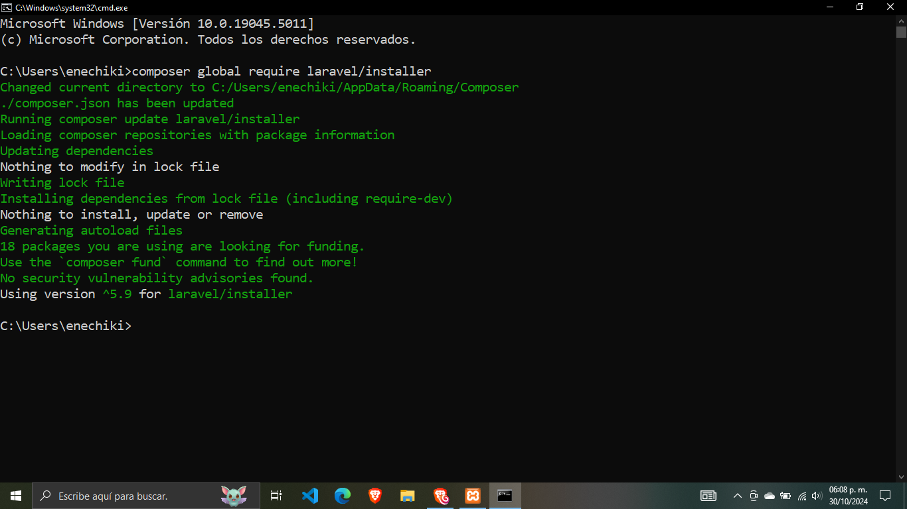  

## Creamos nuestro proyecto e instalamos Jetstream y Livewire.  
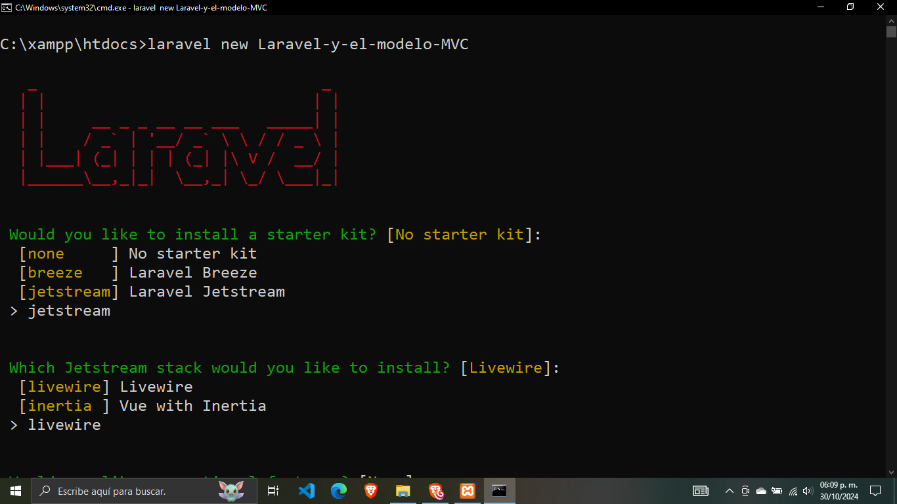  

## No agregamos una característica adicional y optamos por pruebas unitarias.  
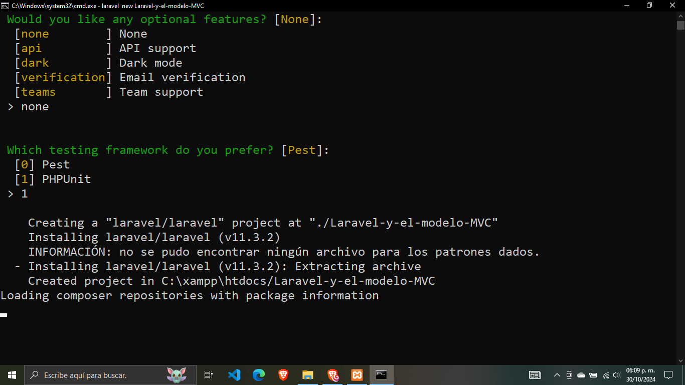  

## Proceso de instalación.  
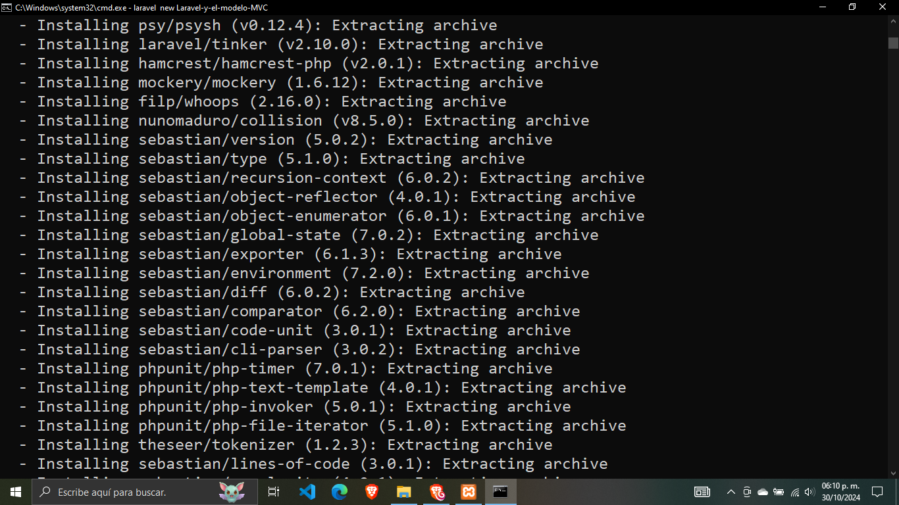  

## Elegimos el gestor de base de datos MySQL que vamos a utilizar.  
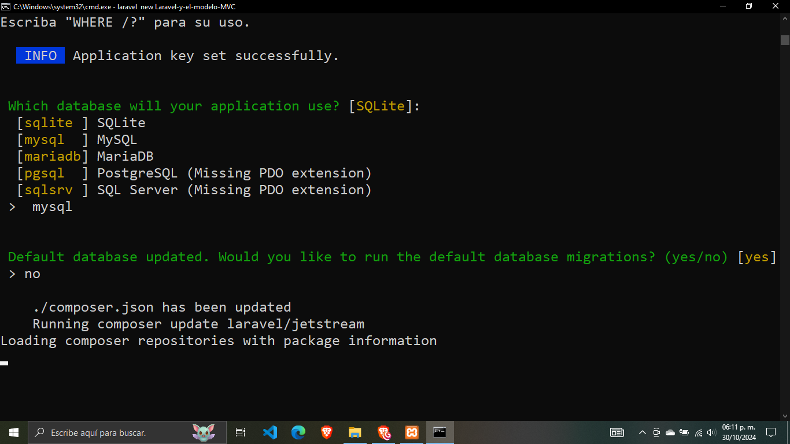  

## Se terminó de configurar nuestro proyecto.  
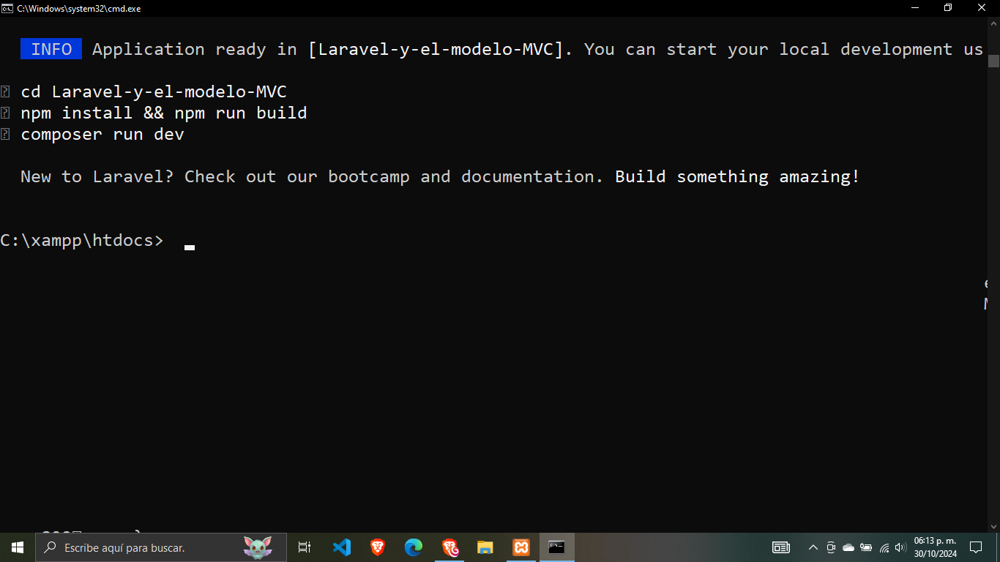  

## Configuramos el archivo .env con el nombre de base de datos enetheldb.  
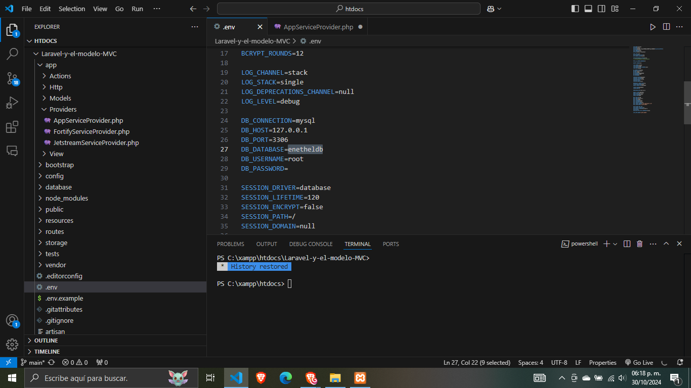  

## En phpMyAdmin creamos la base de datos con el nombre que elegimos: enetheldb.  
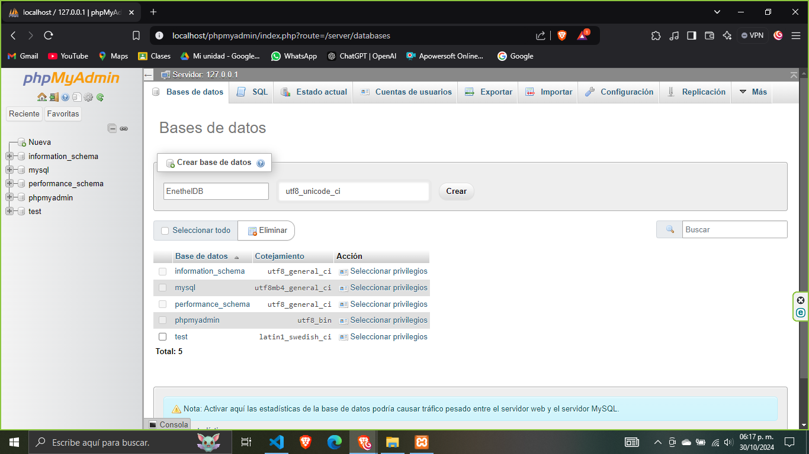  

## Hacemos la migración de nuestro proyecto a la base de datos.  
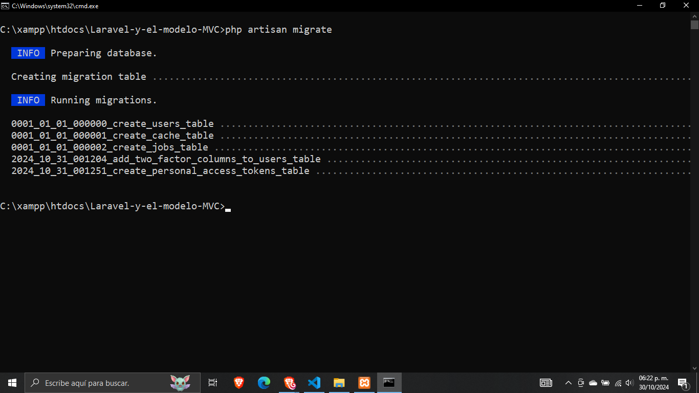  

## La migración se efectuó y vemos las nuevas tablas en la base de datos.  
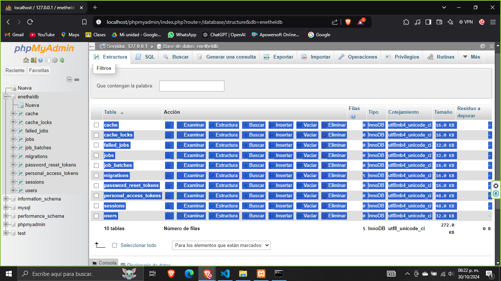  

## Ponemos nuestro nombre en la página principal de la aplicación.  
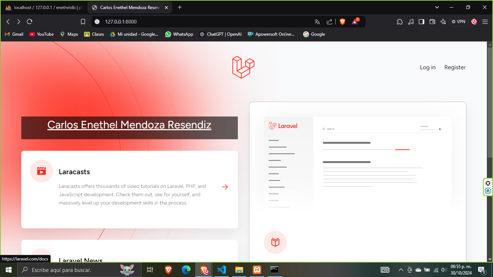  

## Registramos un usuario.  
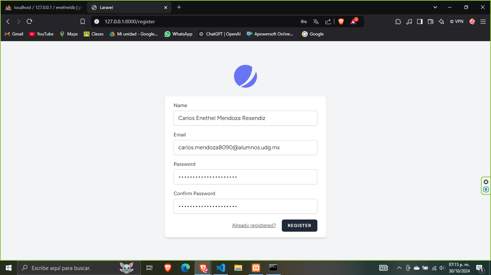  

## Se guardaron exitosamente los datos del registro en la base de datos.  
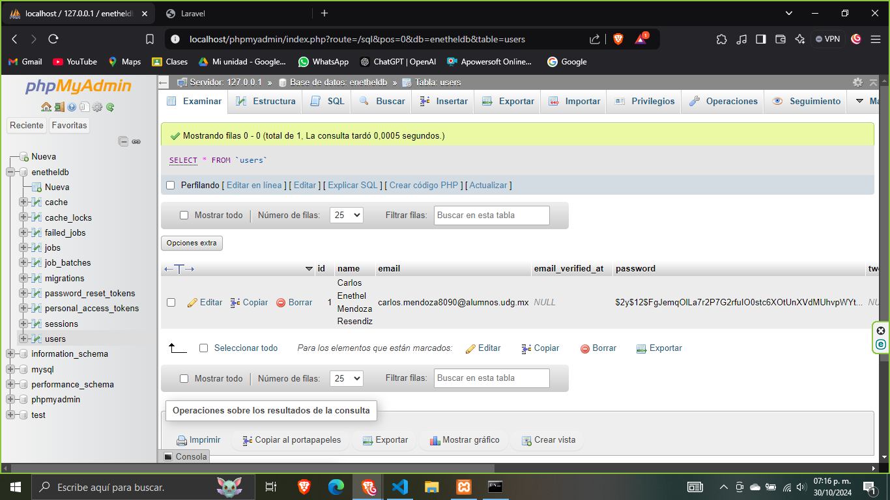  

## Iniciamos sesión con las credenciales del usuario registrado.  
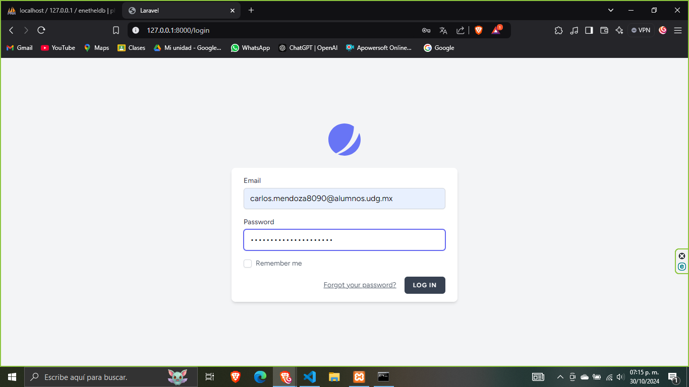  

## Iniciamos correctamente al dashboard de Jetstream.  
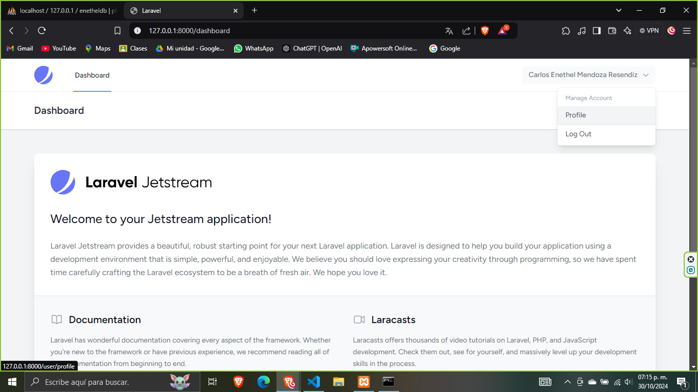  

## Vemos el perfil del usuario.  
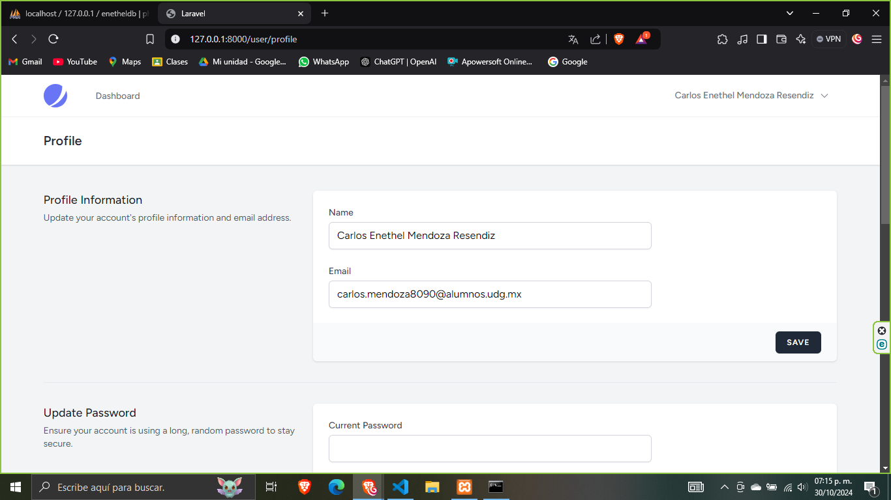  

---

